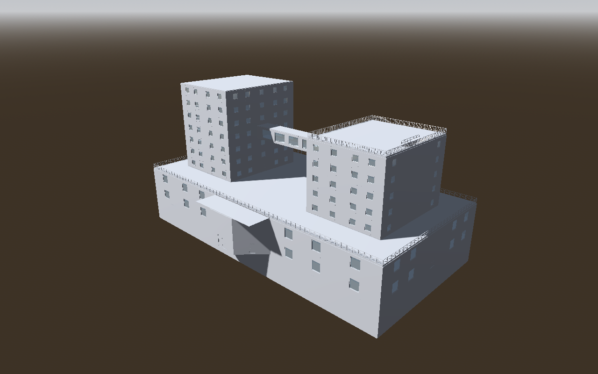

# Halcyon: a limit test of the authoring workflow

The third AI-authored stress test, after [Ravenhold](../ravenhold/README.md) and [Kestrel](../kestrel/README.md). Its job was to find where the tool breaks. It has two parts:

1. **Halcyon**, a mixed-use complex, built through CLI transactions alone. It has 11 levels: two basements, a two-level podium mall, a roof terrace and twin office towers joined by a sky bridge.
2. **Limit probes** (`probes/run-limits.mjs`), which push the tool past normal buildings. They cover thousands of walls, hundreds of floors, near-degenerate angles, far coordinates and every documented limit.

What broke, what was fixed and what still needs a decision are in [FINDINGS.md](FINDINGS.md). Halcyon is **not** added to the example catalog.



## Layout

North is −Z. The podium is 80 × 40 m (x −40..40, z −20..20), with an angled entrance bay to the south.

| Level | Base / walls | What it exercises |
| --- | --- | --- |
| B2 parking | −7 m / 3.2 m | 32 square pillars built as 0.6 m interior wall loops (128 walls); both stair cores; the foot of the car ramp |
| B1 plant | −3.5 m / 3.2 m | Four plant rooms behind a service wall; a loading hall with the top of the 12 m car ramp and its rails |
| L1 mall | 0 m / 4.5 m | Podium outline with an angled bay (8 exterior walls). A 24-sided rotunda whose bulging wall type (`bulge`) faces its centre, with four round-arch passages (`arch` doorway shape). Eight storefronts with doors and display windows, and five entrances. |
| L2 food court | 4.8 m / 4.0 m | `floor.duplicate` of L1, with the rotunda and entrances removed. A 24-corner polygon **void** over the rotunda, ringed by 24 picket rails. |
| L3 roof terrace | 9.1 m / 3.2 m | An 80 × 40 m Floor Footprint terrace with parapet rails and both tower bases. `autoCeiling:false`, so no ceiling hangs over open sky. |
| L4–L7 offices | 12.6–23.1 m | Copies of L3 made with `floor.duplicate` (top-down, so every ID reads `<floor>-<L3 id>`), with the terrace removed and the corridor-end doors swapped for windows |
| L6 sky bridge | 19.6 m | Bridge walls with ten 3.6 m glazing bays between the towers' corridor doors, plus three Floor Footprints (see FINDINGS H1) |
| L8 | 26.6 m | West tower only. The east tower's roof becomes a railed roof deck reached by the east core. |
| L9 penthouse | 30.1 m / top 33.3 m | West tower under a manual flat roof |

Circulation: two switchback cores (x ±29..34, z −6..6), with 19 flights of 1.6 m stairs at 0.175 m risers. The west core runs from B2 to L9 and the east core from B2 to the L8 roof deck. A 3.5 m car ramp joins B2 and B1. Every flight's opening is guarded on its open sides, with rails placed on the model's opening footprint (0.06 m outside the flight).

Totals: 11 floors, 390 walls (24 shaped), 145 doors, 246 windows, 20 stairs/ramps, 82 railings, 205 lights, 5 markers, 147 regions, 6 Floor Footprints and 3 manual roofs. That's 910 transaction operations in 4 files.

## Files

| Path | What it is |
| --- | --- |
| `output/halcyon.building.json` | **The editable building** (schema 10). Load it in the web editor to continue by hand. |
| `output/checks.json` | `validate --warnings-as-errors --reachability --from "0,24"` report |
| `output/navmesh-reachability.json` | Godot navmesh probe (22 targets and route legs) |
| `generate-transactions.mjs` | Generates the four recipes from one layout description |
| `tx-1-podium`, `tx-2-towers`, `tx-3-circulation`, `tx-4-finish` `.edit.json` | Recipes (358, 269, 70 and 213 operations) |
| `probe-targets.json` | Navmesh targets for `../ravenhold/probe/run-reachability.mjs` |
| `build.sh` | Rebuilds everything from a blank building |
| `probes/run-limits.mjs` | The limit probes. They write `limits.json` and per-probe buildings and assets to a new directory. |
| `godot-renders/` | Curated Godot renders (`renders.json` lists every camera). `surface-colors/` holds the shell check; `limits/` holds before/after images for the findings. |

The exported scene (7.8 MB `.tscn` and 141 door scenes) isn't committed. `build.sh` regenerates it in about 10 s. From the editor root, pass a new work directory:

```bash
authoring/halcyon/build.sh ../halcyon-work /path/to/godot
node authoring/halcyon/probes/run-limits.mjs ../halcyon-limits /path/to/godot
```

## Review evidence (AUTHORING_REVIEW §2)

Environment: Linux, Node 22.22.2, Godot 4.5.1 stable. Checks ran headless; renders used Compatibility/OpenGL through Mesa llvmpipe under Xvfb.

| Review item | Status | Evidence |
| --- | --- | --- |
| Schema and authoring validation | Verified | Every recipe passes its dry run and save with `--warnings-as-errors`, as does the final validation (0 errors, 0 warnings). The first pass hit H1 (worked around with Floor Footprints) and H2 (fixed), and exposed H3. |
| Routes (static check) | Verified | `--reachability --from "0,24"`: every walkable m² is reached on all 11 floors, for example 2,954.29 m² on L1 and 359.12 m² on L9 (`output/checks.json`) |
| Routes (Godot navmesh) | Verified | 22 of 22 targets from inside the entrance bay: every level, the B2→B1 ramp (18.5 m), the bridge from corridor to corridor (36.0 m) and the west core from L4 to L9 (58.5 m) |
| Intended floors | Verified | Automatic coverage matches the outlines: podium 3,284 m² on L1, towers 2 × 480 m², L6 1,072 m² with the bridge. Stair and ramp openings are cut; the atrium void is open from L1. |
| Open-air areas | Verified in Godot renders | The terrace and the east roof deck are open to the sky (`godot-renders/limits/floating-ceiling-*.png`: before and after H3's recipe) |
| Profiles and shaped openings | Verified in Godot renders | The rotunda's bulge and round arches render as authored. Surface colours show yellow/orange sides and red reveals (`surface-colors/rotunda-interior.png`). |
| Lighting shells | Verified in Godot surface-colour renders | Grey siding, green slab tops, blue undersides and brown roofs; the bay, bridge and tower roofs are separate. This pass found H8. |
| Export | Verified | `godot-check --assets --require-collision`: 142 scenes, 0 failures |
| Character traversal | Partly verified | Connectivity only. Door swing, stair comfort and headroom under the flights are unverified. |
| Materials | Intentionally omitted | Empty by default |

## Known limits of this blockout

- There's no terrain. The basements show above ground in exterior renders.
- The bay roof is a rectangle, because manual roofs can't follow the angled bay walls. Its corners overhang the angled walls.
- The towers stand on the podium roof with no transfer structure below them. L2 has no walls under the tower walls.
