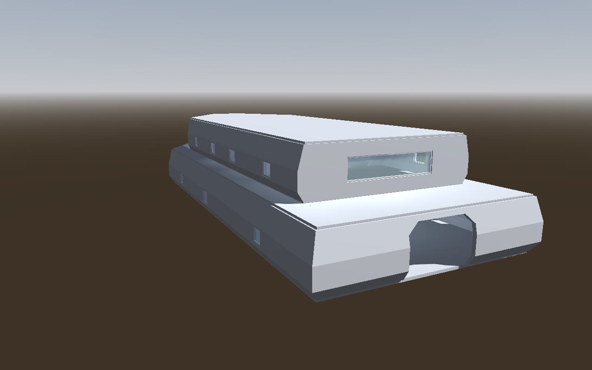

# Kestrel-class courier: an AI-authored starship interior

A second stress test of the authoring workflow, after [Ravenhold](../ravenhold/README.md). It is a two-deck ship interior that exercises **custom wall profiles** (flared hull, hexagonal corridors) and **custom doorway shapes** (octagon hatches, airlocks, blast doors). The goal is walkable game space, not a spacecraft model: there are no engines, thrusters or weapons. The tool issues it exposed are listed in [FINDINGS.md](FINDINGS.md). It is **not** added to the example catalog.



The images in `godot-renders/` are Godot 4.5.1 renders of the exported `.tscn`, made with `godot-check --render --views`. The scene is unmodified. Empty materials show as Godot's default grey. The renderer adds only a camera, sky, sun, ambient light, a short-range camera headlamp and a clear render-only material on `Glass` surfaces.

## Layout

The bow points to +X. Port is −Z, starboard +Z.

| Deck | Elevation / walls | Spaces |
| --- | --- | --- |
| Deck 1: engineering and cargo | 0 m / 3.2 m | Cargo bay with an aft blast-door ramp and the main companionway; hexagonal central corridor; Engineering and Reactor room to port; Storage, Airlock (inner and outer airlock hatches) and Life support to starboard; Sensor bay in the pointed bow |
| Deck 2: crew | 3.38 m / 3.0 m | Observation lounge (wide aft window, stair arrival with rails); hexagonal corridor; Crew quarters 1–2 and Captain's quarters to port; Mess (arched opening to the lounge) and Med bay to starboard; Bridge behind a bulkhead, with three canopy windows |

Construction:

- **Hull (`hull` wall type):** tumblehome. It flares 0.35 m outboard from 18% to 55% of the story height, then tucks back to the plan line under the ceiling. Framed portholes sit in the straight band, 13 of them.
- **Corridors (`corridor` wall type):** hexagonal cross-section, 0.2 m wider on each side at shoulder height. All cabin hatches are empty passages cut through the bend, and their reveals follow the profile.
- **Doorway shapes:**
  - `hatch` (octagon): cabin hatches, plus framed hatch doors on the Standard bulkheads.
  - `airlock`: both airlock hatches and the lounge/mess arch.
  - `blast`: the cargo ramp and the corridor blast doors.
- **Standard walls:** bulkheads, cabin partitions, the bridge canopy and the lounge's aft wall.
- **Circulation:** one 20-riser flight, 1.4 m wide, climbs 3.38 m from the cargo bay to the lounge. Rails guard the stair opening.

Totals: 34 walls (12 shaped), 19 doors (4 framed), 17 windows, 1 stair, 2 railings, 22 ceiling lights, 16 labelled regions. The ship covers 492 m² on Deck 1 and 306 m² on Deck 2.

## Files

| Path | What it is |
| --- | --- |
| `output/kestrel.building.json` | **The editable building** (schema 10). Load it in the web editor to continue by hand. |
| `output/assets/` | Exported `kestrel_class_courier.tscn` and 4 relative door scenes |
| `output/checks.json` | `validate --warnings-as-errors --reachability` report |
| `output/navmesh-reachability.json` | Godot navmesh probe results (18 targets) |
| `generate-transactions.mjs` | Generates the recipes from one layout description |
| `tx-1-structure`, `tx-2-openings`, `tx-3-circulation`, `tx-4-lighting` `.edit.json` | Transaction recipes (58, 36, 3 and 22 operations) |
| `probe-targets.json` | Navmesh probe targets for `../ravenhold/probe/run-reachability.mjs` |
| `build.sh` | Rebuilds everything from a blank building |
| `godot-renders/` | Curated Godot renders (`renders.json` gives each camera); `surface-colors/` shows the `--surface-colors` shell check |

From the editor root, pass a new work directory:

```bash
authoring/kestrel/build.sh ../kestrel-work /path/to/godot
```

## Authoring sequence

1. `node cli.mjs new`, then `tx-1-structure`:
   - `building.update`: 0.25 m walls, 3 m default story, flat roof, no overhang.
   - Deck 1 gets 3.2 m walls; `floor.add-top` adds Deck 2.
   - `wallType.add` creates the 2 profiles and `openingShape.add` the 3 doorway shapes (schema 10).
   - 34 walls and 16 regions are added. Shaped walls get `wallTypeId` in `wall.add`; each corridor wall's `inwardToward` points at the corridor centreline.
2. `tx-2-openings`: 19 doors with `shapeId`, 4 canopy/observation windows and 13 portholes, all placed by world point (`at`).
3. `tx-3-circulation`: the stair and two railings.
4. `tx-4-lighting`: 22 cool-white omni lights (`light.add`), 0.35 m under each ceiling, shadows off: one per room, more along the corridors and in the cargo bay.

The whole ship is built with CLI commands only. The first version needed a scoped JSON edit for the wall types, shapes and assignments (FINDINGS K1, now fixed); the CLI-only rebuild produces an identical building and byte-identical scenes. Every recipe passed its dry run and save with `--warnings-as-errors`. No step needed a retry after its dry run. The profile and junction rules shaped the plan up front instead (FINDINGS K6).

## Review evidence (AUTHORING_REVIEW §2)

Environment: Linux, Node 22.22.2, Godot 4.5.1 stable. Checks ran headless; renders used Compatibility/OpenGL through Mesa llvmpipe under Xvfb.

| Review item | Status | Evidence |
| --- | --- | --- |
| Schema and authoring validation | Verified | 0 errors, 0 warnings (`output/checks.json`) |
| Routes (static check) | Verified | `--reachability`: 394.63 of 394.63 m² reached on Deck 1 and 224.16 of 224.16 m² on Deck 2, entering by the cargo ramp and outer airlock hatch. Shaped walls block by their profile's reach up to body height, so the corridor walls' 0.2 m bulge into the cabins is counted. |
| Routes (Godot navmesh) | Verified | 18/18 probe checks pass from a start inside the cargo ramp: all 16 rooms, airlock to Deck 1 corridor through the inner hatch in 4.3 m, and cargo bay to bridge in 34.8 m. Every start and target lies on the navmesh (the probe now fails a point that has to snap more than 0.6 m) (`output/navmesh-reachability.json`) |
| Intended floors | Verified | Automatic coverage matches the hull loops: 492 and 306 m², minus the 7.7 m² stair opening |
| Profiles and shaped openings as exported | Verified in Godot renders | The flared hull, hex corridors and every hatch shape render as authored. Hatch reveals follow the corridor bend. Portholes sit in the straight hull band. |
| Lighting shells | Verified in Godot surface-colour renders | Grey siding outside, pink inside, orange/yellow corridor sides, teal only on reveals and wall tops (`godot-renders/surface-colors/`). This pass found and fixed the z-fighting skirt underside (FINDINGS K0). |
| Export | Verified | `godot-check --assets --require-collision`: 5 scenes, 0 failures |
| Ceiling finish | Verified in Godot renders | One flat ceiling per deck after the K2 fix; there's no longer a step where Deck 2 ends (`godot-renders/interior-check/ceiling-step-before-after.png`) |
| Character traversal | Partly verified | Connectivity only. Door swing, stair comfort and headroom along the flight are unverified. |
| Lights | Verified in Godot renders | 22 exported `OmniLight3D` nodes light every room (`godot-renders/`) |
| Materials | Intentionally omitted | Empty by default |

## Known limits of this blockout

- It sits on the ground plane: there's no terrain, and the cargo ramp is a doorway at floor level with no ramp.
- Ship "hull" features such as nacelles, fins or curved roofs are out of scope and would be separate art.
