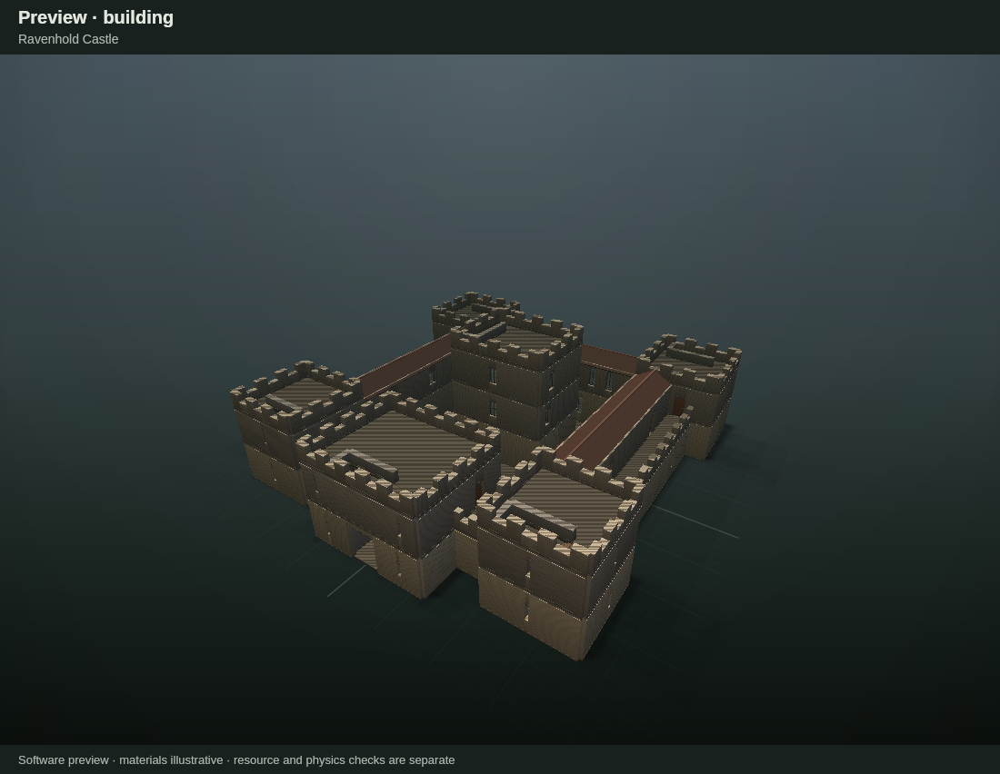

# Ravenhold Castle: an AI-authored building made with the CLI workflow

An enterable four-level castle blockout, built only from the documented CLI workflow ([LLM_GUIDE.md](../../LLM_GUIDE.md) and [AUTHORING_REVIEW.md](../../AUTHORING_REVIEW.md)) plus two small, scoped JSON edits for settings that no transaction can change. This is a test of the workflow. It is **not** added to the example catalog or the regression fixtures. Tool issues found along the way are listed in [FINDINGS.md](FINDINGS.md).



## Brief and assumptions

"A cool castle" was interpreted as follows:

- An enterable, walkable blockout: a square curtain wall with four corner towers, a gatehouse and a free-standing keep inside an open courtyard.
- Towers stand taller than the curtain wall, and the keep is taller than the towers.
- The wall walks are open to the sky, with crenellated parapets.
- There are furnished-scale rooms on every enclosed level. Furniture and gameplay are out of scope.
- Materials are left empty, as the exporter intends.

| Level | Elevation | Contents |
| --- | --- | --- |
| Ground (4.0 m walls) | 0 m | Gate tunnel with two guard rooms and two stores; great hall; north and south barracks; storehouse; stables; four tower rooms; keep undercroft; courtyard |
| Ramparts (3.5 m) | 4.18 m | Wall walks (2.5 m clear on the north, east and west; 4 m on the south). Four tower rooms, guest chambers, chapel, armory, garrison hall, gatehouse winch room and the keep's great chamber |
| Tower tops (3.5 m) | 7.86 m | Four crenellated tower roofs, the gatehouse roof and the keep's lord's chamber |
| Keep roof (3.0 m) | 11.54 m | Crenellated keep roof terrace |

Circulation, reserved before any detailing:

- **Courtyard to walls:** two courtyard stairs climb to the south wall walks.
- **Towers:** each tower has a stair from the ground to the ramparts and another from the ramparts to the roof. The wall walks pass through the tower rooms.
- **Gatehouse:** a stair runs from the winch room to the gatehouse top.
- **Keep:** three stacked flights connect all four levels.
- **Guarding:** every stair opening is guarded by 1 m walls where it would otherwise leave a drop.

The final model has 362 walls, 91 openings (33 of them doors), 14 stairs, 3 independent gable roofs and 41 regions.

## Files

| Path | What it is |
| --- | --- |
| `output/ravenhold_castle.building.json` | **The editable building.** Load it in the web editor to continue by hand. |
| `output/assets/` | Exported `ravenhold_castle.tscn` and 33 relative door scenes |
| `output/checks.json`, `output/godot-check.json`, `output/reachability*.json` | Evidence reports: see the review below |
| `generate-transactions.mjs` | Generates the five transaction recipes from one layout description |
| `tx-1-levels` … `tx-5-circulation.edit.json` | The version-1 transaction recipes actually applied, in order |
| `prepare-base.mjs`, `mark-open-boundary.mjs` | The two scoped JSON edits (see FINDINGS F2/F3) |
| `probe/` | Godot navmesh reachability probe (see FINDINGS F1) |
| `build.sh` | Rebuilds everything above from `examples/courtyard_regions.building.json` |
| `previews/` | Software renders used for review (v1 = before the circulation fix) |

To reproduce everything from the editor root, pass a new work directory:

```bash
CANVAS_MODULE=/path/to/@napi-rs/canvas/index.js authoring/ravenhold/build.sh ../ravenhold-work /path/to/godot
```

A clean rebuild reproduced the committed building JSON and every scene byte-for-byte.

## Authoring sequence

1. **Base.** Start from a copy of `courtyard_regions`. A scoped JSON edit sets the name, 0.5 m walls, `roof.type: none` and `autoCeiling: false` on floor 1.
2. **tx-1.** Remove the example's contents, set the story heights, add three top floors (no automatic ceilings), 41 regions and 354 walls. The dry run left one warning: Floor 2's parapets have open ends.
3. **Scoped JSON edit.** Set `boundaryMode: intentional_open` on the Ramparts floor. That resolves the warning.
4. **tx-2 to tx-4.** Add the openings, stairs and roofs. Each was dry-run with `--warnings-as-errors`, reviewed, then saved to a new path.
5. **Review of v1.** The plan renders suggested that each tower's ground stair arrived in a pocket boxed in by its own opening and the upper flight. The rampart-level stair openings were also unguarded.
6. **tx-5.** Reverse the eight tower flights so each arrives in the open room, move the tower-top guards, add guards around the rampart-level and keep stair openings, and move one keep window clear of a new guard.

## Review evidence (AUTHORING_REVIEW §2)

Environment: Linux, Node 22.22.2, @napi-rs/canvas (software previews), Godot 4.5.1 stable (headless). Godot 4.7 was not available. A live browser was not run; the web-load check used the DOM harness.

| Review item | Status | Evidence |
| --- | --- | --- |
| Schema and authoring validation | Verified | `validate --warnings-as-errors`: 0 errors, 0 warnings (`output/checks.json`) |
| Entrance to usable interior | Verified | Empty 3 × 3.6 m gate openings at z = 20 and z = 10. The gate tunnel reaches the courtyard in 11 m on the navmesh. |
| Every ground room | Verified | 15 ground-floor targets reachable from the gate tunnel (`output/reachability.json`) |
| Each occupied upper level | Verified | All 22 upper targets reachable, including every tower top and the keep roof. Keep undercroft to keep roof is 43 m. |
| Towers, gatehouse and keep connections | Verified | Each tower's rampart room reaches its roof in 14 m or less and its ground room in 15.5 m. Each tower has doors to two wall walks. |
| Intended floors | Verified | `inspect` coverage is 1184, 831, 420 and 74 m², matching the authored regions minus the stair openings. Plan renders show no holes except the stair openings. |
| Courtyard | Verified | Ground slab (floor 1 solid region). No ceiling or roof above it: floor 1 `autoCeiling` is false and the roof type is `none`. |
| Walks and parapets | Verified in geometry | Continuous walks, passing through the tower rooms. Crenellated parapets (1.7 m merlons, 1.0 m crenels) on outer edges. 1.0 m guards on the south walks' courtyard edge, left open where the stairs arrive. |
| Architectural brief | Verified visually | Opposite exterior views, a front view and a low north-east view (`previews/`) show the gatehouse, towers, keep, courtyard and roofs |
| Export | Verified | `export`: 34 scenes. `godot-check --require-collision` (Godot 4.5.1): 873 collision shapes, 0 failures, 0 material surfaces. |
| Web editor round trip | Verified (DOM harness) | Loaded through the web handlers with 0 errors. Web export is byte-identical to the CLI scene and all 33 door scenes. |
| Character traversal | Partly verified | A navmesh approximation (0.3 m radius, 1.8 m height, 0.3 m step, 46° slope, door panels treated as open) was run in Godot 4.5.1. This is **not** a CharacterBody3D walk test: door swing, stair step collision feel and headroom along each flight remain unverified. |
| Materials | Intentionally omitted | Empty by default |

### Probe controls

- **v1 (before tx-5):** all 47 checks passed. The tower "pocket" seen in the renders was not a hard block: the navmesh steps across the top of the flush ground flight. tx-5 still improves the arrival, since it no longer needs a sideways step across a stair. But the v1 problem was a quality issue, not a broken route (`output/reachability-v1.json`).
- **Negative control:** a copy with all seven ground-floor stairs removed passes `validate --warnings-as-errors` with **zero warnings**, yet 27 of 47 probe checks fail, and nothing above ground can be reached (`output/reachability-control-no-ground-stairs.json`). So the probe can detect unreachable levels, and the built-in checks cannot.

## Known limits of this blockout

- All walls share the building's single 0.5 m thickness, so parapets and stair guards are as thick as the curtain wall (FINDINGS F6).
- The upper-range roofs are simple gables with no gable fill (`gableEnds: none`). They rely on the abutting tower walls and parapets, which rise above the ridge, to close their ends.
- There is no terrain outside the walls. The gate opens onto nothing until the scene is placed on game terrain.
- Stair flights are fairly steep (about 40°, 0.175 m risers on 0.21 m treads) to fit inside 8 m towers.
