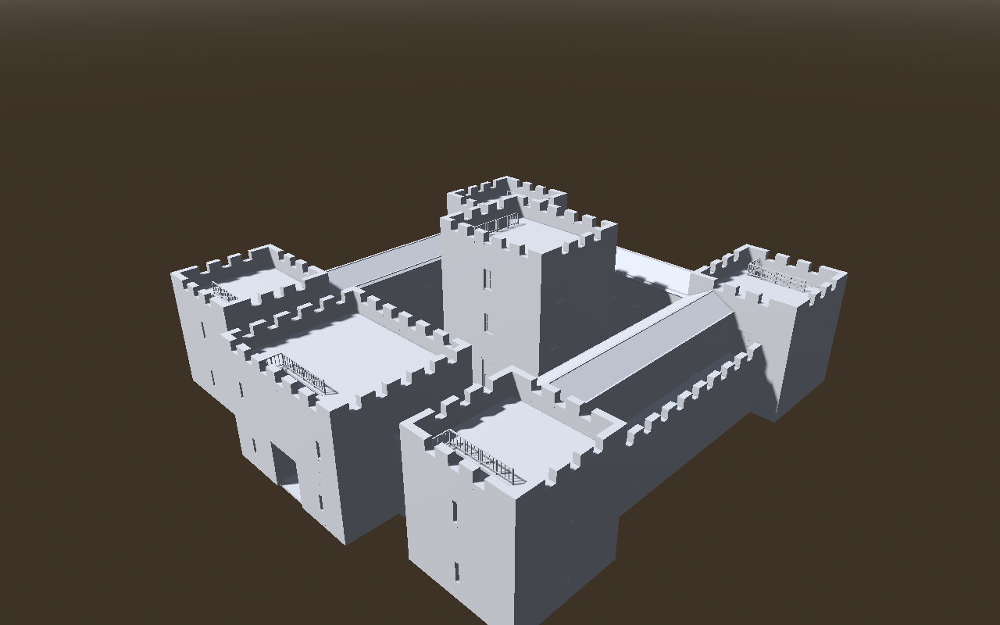

# Ravenhold Castle: an AI-authored building made with the CLI workflow

An enterable four-level castle blockout, built entirely through the CLI: `node cli.mjs new` followed by four version-1 transaction recipes, with no hand-written JSON edits. It began as a test of the authoring workflow ([LLM_GUIDE.md](../../LLM_GUIDE.md), [AUTHORING_REVIEW.md](../../AUTHORING_REVIEW.md)). The tool issues it exposed are listed, with their fixes, in [FINDINGS.md](FINDINGS.md). It is **not** added to the example catalog. The reachability regression test (`reachability-tests.mjs`) does read its building JSON.



The images in `godot-renders/` are Godot 4.5.1 renders of the exported `.tscn`, made with `godot-check --render`. The scene is unmodified: empty materials show as Godot's default grey, and only a camera, sky, sun and ambient light were added.

## Brief and assumptions

"A cool castle" was interpreted as follows:

- An enterable, walkable blockout: a square curtain wall with four corner towers, a gatehouse and a free-standing keep inside an open courtyard.
- Towers stand taller than the curtain wall, and the keep is taller than the towers.
- The wall walks are open to the sky, with crenellated parapets.
- Every enclosed level has rooms. Furniture and gameplay are out of scope.
- Materials are left empty, as the exporter intends.

| Level | Elevation | Contents |
| --- | --- | --- |
| Ground (4.0 m walls) | 0 m | Gate tunnel with two guard rooms and two stores; great hall; north and south barracks; storehouse; stables; four tower rooms; keep undercroft; courtyard |
| Ramparts (3.5 m) | 4.18 m | Wall walks (2.5 m clear on the north, east and west; 4 m on the south). Four tower rooms, guest chambers, chapel, armory, garrison hall, gatehouse winch room and the keep's great chamber |
| Tower tops (3.5 m) | 7.86 m | Four crenellated tower roofs, the gatehouse roof and the keep's lord's chamber |
| Keep roof (3.0 m) | 11.54 m | Crenellated keep roof terrace |

Circulation:

- **Courtyard to walls:** two courtyard stairs climb to the south wall walks.
- **Towers:** each tower has a stair from the ground to the ramparts and another from the ramparts to the roof. The wall walks pass through the tower rooms.
- **Gatehouse:** a stair runs from the winch room to the gatehouse top.
- **Keep:** three stacked flights connect all four levels.
- **Guarding:** picket railings surround every stair opening and line the south walks' courtyard edge.

The model has 116 walls, 91 doors and windows (36 door openings: 33 with door scenes, plus two gates and a stable doorway left as empty passages), 118 crenels on 29 parapet walls, 14 stairs, 24 railings, 3 independent gable roofs and 41 regions.

## Files

| Path | What it is |
| --- | --- |
| `output/ravenhold_castle.building.json` | **The editable building.** Load it in the web editor to continue by hand. |
| `output/assets/` | Exported `ravenhold_castle.tscn` and 33 relative door scenes |
| `output/checks.json`, `output/reachability-checks.json` | Saved check reports: strict validation, and the `--reachability` route check |
| `output/navmesh-reachability.json` | Godot navmesh traversal probe results (47 targets) |
| `output/history-v2/` | Probe results from the earlier hand-edited version, cited in FINDINGS F1 |
| `generate-transactions.mjs` | Generates the four transaction recipes from one layout description |
| `tx-1-structure` … `tx-4-roofs.edit.json` | The recipes, applied in order to `node cli.mjs new` |
| `probe/` | Godot navmesh reachability probe: an independent check alongside the built-in static one |
| `build.sh` | Rebuilds everything from a blank building |
| `godot-renders/` | Curated Godot renders; `renders.json` gives each camera |

To reproduce everything from the editor root, pass a new work directory:

```bash
authoring/ravenhold/build.sh ../ravenhold-work /path/to/godot
```

`build.sh` output matched a manual step-by-step application of the same recipes byte-for-byte.

## Authoring sequence

1. **`new`:** a blank one-floor building (floor ID `floor_1`).
2. **`tx-1-structure`** (162 operations):
   - `building.update` sets 0.5 m walls and `roof.type: none`.
   - Floor updates set story heights, and every floor gets `autoCeiling: false`, so the walks and tops stay open.
   - Three top floors, 41 regions and 116 walls are added.
3. **`tx-2-openings`** (120 operations): 91 doors and windows placed by world point (`at`), plus 29 `wall.crenellate` operations.
4. **`tx-3-circulation`** (38 operations): 14 stairs and 24 railings.
5. **`tx-4-roofs`** (3 operations): fully specified `roof.add` gables over the upper range rooms.

Every recipe passed its dry run and save with `--warnings-as-errors`.

## Review evidence (AUTHORING_REVIEW §2)

Environment: Linux, Node 22.22.2, Godot 4.5.1 stable (headless for checks; Compatibility/OpenGL through Mesa llvmpipe under Xvfb for renders). Godot 4.7 was not available.

| Review item | Status | Evidence |
| --- | --- | --- |
| Schema and authoring validation | Verified | `validate --warnings-as-errors`: 0 errors, 0 warnings (`output/checks.json`) |
| Routes (static check) | Verified, with 4 small exceptions | `validate --reachability`: every labelled room, walk and roof on all four floors connects to open ground. It reports four dead corners of 1.3–1.4 m², one per tower on the rampart floor, behind the top of the tower's roof stair and beside the ground-stair opening. They are unused corners, not rooms (`output/reachability-checks.json`). |
| Routes (Godot navmesh) | Verified | All 47 probe checks pass: 37 destinations and 10 route legs, including each tower's rampart room to its roof in 14 m or less, and keep undercroft to keep roof in 43 m (`output/navmesh-reachability.json`). |
| Intended floors | Verified | `inspect` coverage matches the authored regions minus stair openings |
| Courtyard and open walks | Verified | Ground slab under the courtyard. No ceilings or roofs over the courtyard, walks or tops: `roof.type none` and `autoCeiling: false`. The Godot renders confirm this. |
| Parapets and guards | Verified in Godot renders | 118 crenels (0.8 m wide, 0.7 m deep) between merlons of at least 1 m on the 1.7 m parapets. Picket railings at every stair opening. |
| Architectural brief | Verified in Godot renders | Four exterior diagonals and an aerial view (`godot-renders/`) show the gatehouse, towers, keep, crenellations and roofs |
| Interiors as exported | Verified in Godot renders | Eye-level views of the gate tunnel, courtyard, great hall, tower rooms, wall walks, chapel, great chamber, tower tops and keep roof |
| Export | Verified | `godot-check --assets --require-collision` (Godot 4.5.1): 34 scenes, 865 collision shapes, 239 mesh instances, 0 material surfaces, 0 failures |
| Character traversal | Partly verified | The static route check and the navmesh probe are connectivity checks. Door swing, stair comfort and headroom along each flight are unverified. |
| Lighting shells | Verified in Godot surface-colour renders | After the F14 exporter fix: grey siding wraps every corner, story seams are closed, InsideFaces only face rooms, and EdgeFaces appear only on wall tops, reveals and crenels (`godot-renders/surface-colors/`) |
| Materials | Intentionally omitted | Empty by default |

## Known limits of this blockout

- Wall thickness is building-wide (0.5 m), so interior partitions are as thick as the curtain wall (FINDINGS F6).
- The upper-range roofs are simple gables with no gable fill (`gableEnds: none`). They rely on the abutting tower walls, which rise above the ridge, to close their ends.
- There is no terrain outside the walls. The gate opens onto nothing until the scene is placed on game terrain.
- Stair flights are fairly steep (about 40°, 0.175 m risers on 0.21 m treads) to fit inside 8 m towers.
- The Godot renders use a software rasterizer with an added sun and ambient light. Lighting in a game scene will differ.
